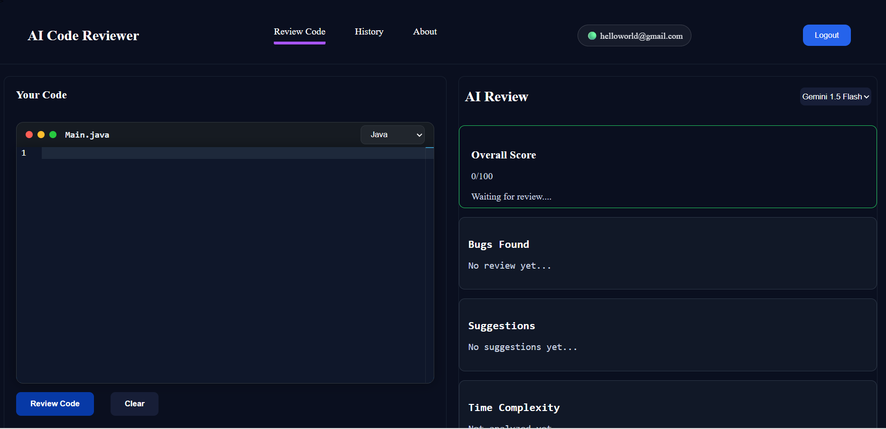
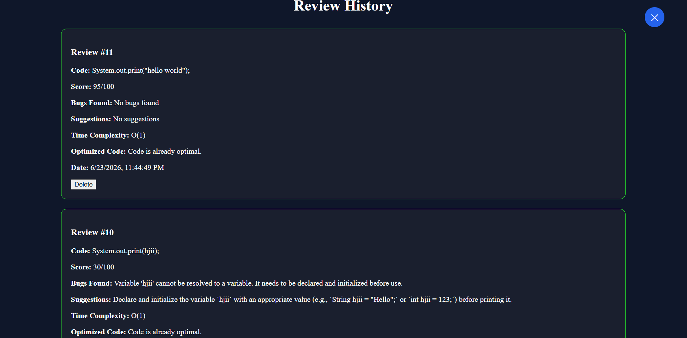
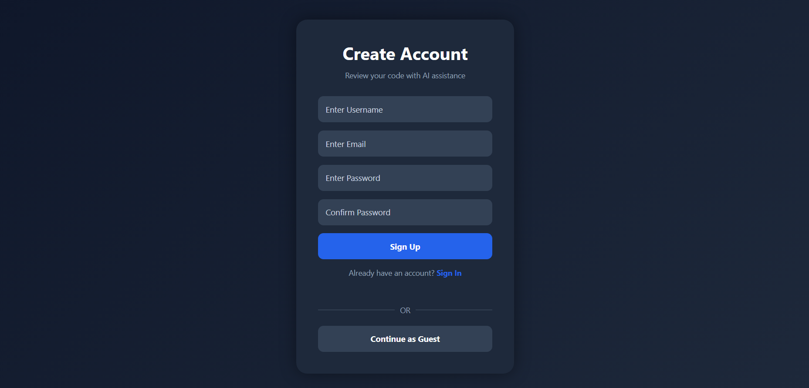
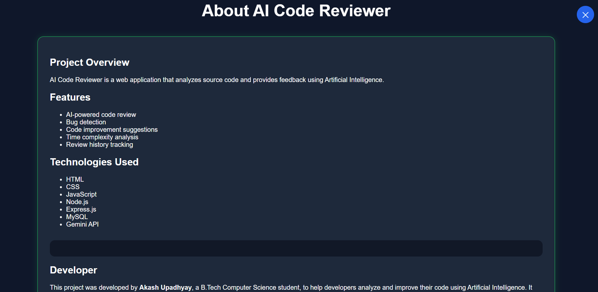

# 🤖 AI Code Reviewer

An AI-powered Full Stack Web Application that reviews source code, detects bugs, provides improvement suggestions, analyzes time complexity, and generates optimized code using Google Gemini AI and Groq API.


---

## 📖 Overview

AI Code Reviewer is a Full Stack web application that allows users to submit source code and receive AI-generated feedback. It detects bugs, provides improvement suggestions, analyzes time complexity, and generates optimized code to help developers write cleaner and more efficient programs.

---

## ✨ Features

- 🤖 AI-powered Code Review
- 🐞 Bug Detection
- 💡 Code Improvement Suggestions
- ⚡ Time Complexity Analysis
- 🚀 Optimized Code Generation
- 👤 User Authentication
- 📜 Review History
- 🗑️ Delete Individual Review
- 🧹 Delete All Reviews
- 📱 Responsive User Interface

---

## 🛠️ Tech Stack

### Frontend
- HTML5
- CSS3
- JavaScript

### Backend
- Node.js
- Express.js

### Database
- MySQL

### AI
- Google Gemini API
- Groq API

### Tools
- Git
- GitHub
- VS Code

---

## 📂 Folder Structure

```text
AI-CODE-REVIEWER
│
├── screenshots/
│   ├── main.png
│   ├── answer.png
│   ├── history.png
│   ├── authentication.png
│   └── about.png
│
├── index.html
├── auth.html
├── history.html
├── about.html
├── script.js
├── history.js
├── server.js
├── style.css
├── auth.css
├── history.css
├── about.css
├── package.json
├── package-lock.json
├── .gitignore
└── README.md
```

---

## ⚙️ Installation

Clone the repository

```bash
git clone https://github.com/Akash-upadhyay12/AI-CODE-REVIEWER.git
```

Go to the project folder

```bash
cd AI-CODE-REVIEWER
```

Install dependencies

```bash
npm install
```

Create a `.env` file

```env
GEMINI_API_KEY=YOUR_GEMINI_API_KEY
GROQ_API_KEY=YOUR_GROQ_API_KEY
DB_HOST=localhost
DB_USER=root
DB_PASSWORD=your_password
DB_NAME=ai_code_reviewer
PORT=5000
```

Run the backend

```bash
npm start
```

Open the frontend in your browser.

---

## 📸 Screenshots

### Home Page


### Review Result


### History Page


### Login Page


### About Page


---

## 🚀 Future Improvements

- Email Verification
- Dark/Light Mode toggle
- Download Review as PDF
- Multi-language Support
- AI Provider Switching
- Review Analytics Dashboard

---

## 📚 Learning Outcomes

- Full Stack Web Development
- REST API Development
- Express.js
- MySQL Database
- AI API Integration
- CRUD Operations
- Git & GitHub
- Responsive Web Design
- Error Handling

---

## 👨‍💻 Author

**Akash Upadhyay**

GitHub: https://github.com/Akash-upadhyay12

LinkedIn: https://www.linkedin.com/in/akashupadhyay07/

LeetCode: https://leetcode.com/u/akash_upadhyay1234/

---

## ⭐ Support

      Thanks !!!